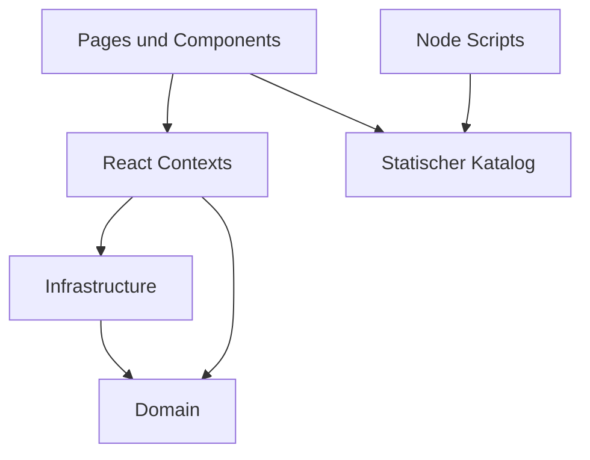

# Architecture

## Modulübersicht

- `src/domain`: reine Logik für Katalog, Profil, Suche, Empfehlungen, Glücksrad, Entdecken und YouTube-Klassifikation.
- `src/infrastructure`: Browser- und Datenquellenzugriff.
- `src/contexts`: React Provider für Katalog und Profil.
- `src/components`: wiederverwendbare UI-Bausteine.
- `src/pages`: Route-Level-Views.
- `scripts`: Katalogsync und Validierung.

## Abhängigkeitsrichtung

Domain kennt React und Browser-APIs nicht. UI nutzt Contexts. Contexts nutzen Infrastructure. Infrastructure nutzt Domain-Parser.

## Domain versus Infrastructure

Profiloperationen sind pure Functions. `LocalProfileRepository` ist die einzige Schicht, die `localStorage` berührt.

## Datenfluss

Beim Start lädt die App `public/catalog/episodes.json`. Parallel wird das lokale Profil gelesen oder neu angelegt. UI-Interaktionen ändern das Profil über Domain-Funktionen und werden anschließend gespeichert.

## Startup und Fehlerbehandlung

Katalogfehler zeigen einen deutschen Fehlerzustand ohne Stacktrace. Beschädigte Profile werden neu angelegt und im Profilstatus transparent angezeigt.

## Erweiterungspunkte

Eine spätere OneDrive-Synchronisation kann als weiteres `ProfileRepository` ergänzt werden. Domain und UI dürfen nicht direkt von Microsoft Graph abhängen.
